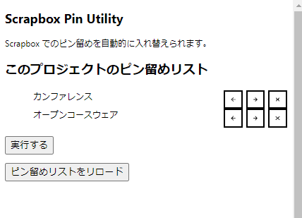

## Scrapboxのピン留めを入れ替えるChrome拡張機能？

### （注意）最後まで動きません
- このリポジトリは記録用のものです。

### 概要
- プロジェクトのトップページで、この拡張機能のボタンをクリックすると、次のようなメニューが開きます

----

- これは、そのプロジェクトのピン留めページの一覧です。
    - ページごとの ← ボタンで前に移動。
    - ページごとの → ボタンで後ろに移動。
    - ✕ボタンでピン留めを解除。

- 入力し終わったら、「実行する」ボタンを押します。
    1. 自動的に、最小限の操作を計算します。
    2. Pin, Unpin が必要な各ページに自動的に遷移します。
    3. Pin を行います（**ここを実装できていません。**）
        - この方法では不可能だと思ったため
